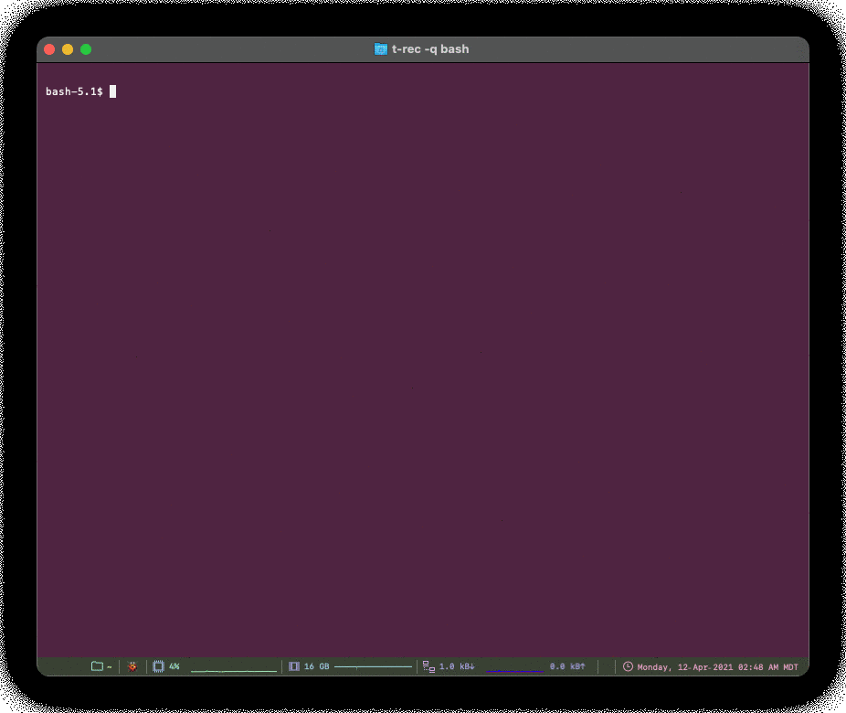

# mmotd &nbsp; 

## Modified Message of the Day

<table class="tg">
<tbody>
  <tr>
    <td class="tg-0lax">
      
      
      
    </td>
  </tr>
  <tr>
    <td class="tg-0lax">
      
      
    </td>
  </tr>
  <tr>
    <td class="tg-0lax">
      
      
      
      
    </td>
  </tr>
</tbody>
</table>

<table class="tg">
<tbody>
  <tr>
    <td class="tg-0lax">
      
    </td>
  </tr>
</tbody>
</table>

### Introduction

The `/etc/motd` is a file on `Unix`-like systems that contains a "**message of the day**", used to send a common message to all users in a more efficient manner than sending them all an e-mail message. Other systems might also have an motd feature, such as the motd info segment on `MULTICS`.

The idea that a set of information could be printed everytime I open a new terminal enticed me. But what was even more enticing is the customization of that message.
1. I wanted the ability to turn on/off features of the `motd`.
1. I also wanted the ability to either pre-process and/or post-process the information gathered by any or all of the `motd` segments so I could colorize them, strip them of certain information, etc.
1. Most importantly, I wanted the ability to describe the information which the client would want to print by specifying both a `configuration` and a `template` file.

I did a majority of this work already inside a `Python` script.  Unfortunately, it wasn't until I finished that I noticed that my performance was noticeable.  [**No, I mean really noticeable!  Each new open terminal would take quite a few seconds to start. This was in contrast to terminals which would instantaneously open.**]

I ran profilers on the code and found a number of bottle necks which I could and should eliminate.  I thought about caching values on disk and only refreshing that data periodically by running a  `cron` (or some other scheduler) task periodically.

After deliberating my options for a few seconds I hastily decided that it would be a good exercise to start from scratch.

Hence, `modified message of the day` or `mmotd`
